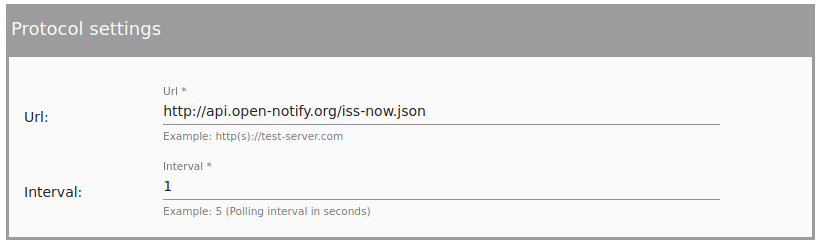
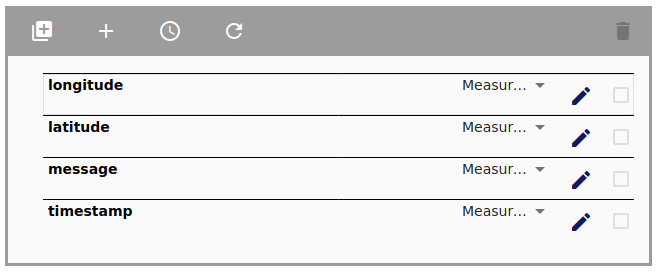
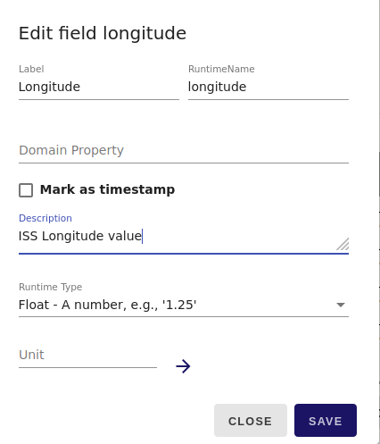
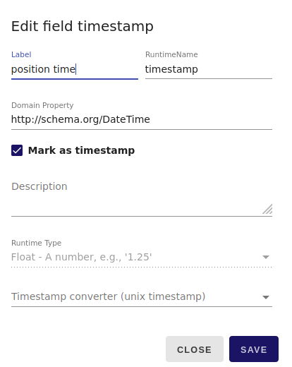
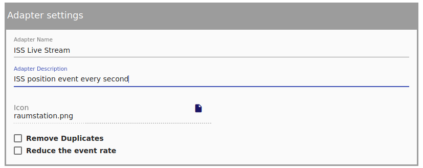

<header>
Geo Adapter Sources
===
</header>

# Introduction

Here you can find a list of geo-event stream.

## Sources for geo-events
* ISS live monitoring: http://api.open-notify.org/iss-now.json
* more to come

### Setup ISS Live Adapter

* Click on *Streampipes Connect*  choose REST HTTP Stream
   

    

* In *Protocol settings* add the ISS live monitoring url, choose an interval e.g. 1 second.  and press next.
   

   

* Choose  Json Object and click next.
* Setup the Source:
  * Move the longitude and latitude values via drag & drop out of the *iss_position* folder. Afterwards delete the iss_position folder.
     

     

  *  Modify the longitude value setup by clicking the *pencil-button* and change the *Runtime Type* from *String* to *Float*. You can also add infos for *Label* and *Description*.
     

     

  * Modify the latitude value the same way.

  * Modify the timestamp by clicking the *pen-button* and activate *Mark as timestamp* and choose *timestamp converter (unix timestamp)*  
     

     

  * Click next and fill out the *Adapter settings* with a name, description. Also add an icon e.g. [raumstation.png](downloads/raumstation.png) from the download folder [1](#myfootnote1)
     

     

  * Start the adapter and watch the live events coming in.

Alternative you can use the provided adapter template in the download folder.

<a name="myfootnote1">1</a>: "Icon made by Freepik perfect from www.flaticon.com"
