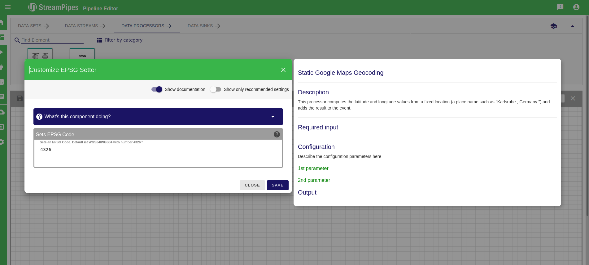
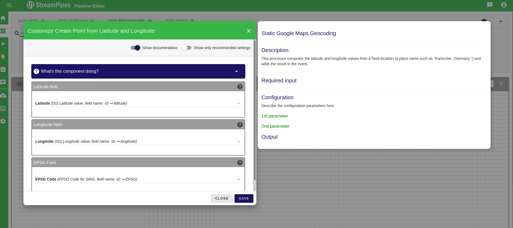
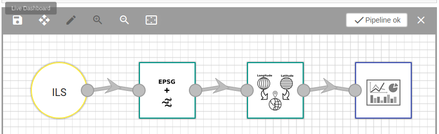

<header>
StreamPipes Geo-Pipelines
===
</header>

# Introduction

## Basic Geo-Pipeline

Creates a geometry WKT event property due transferring Latitude Longitude value to a JTS Point geometry.

### Requierments
 * To convert Longitude and Latitude into a JTS Point geometry you need following resources
   * Geo data source
     * ISS Adapter
   * Data processors:
      * EPSG Enricher
      * LatLngToGeo
   * Data sink
     * Dashboard

### Setup

* Open the *pipeline editor* and add the ISS Adapter
* Add to EPSG Enricher and add the default EPSG 4326.
   

   

* Add the LatLngToGeo data processor with following settings:
   

    
* Add Dashboard for Data Sink and give it a name; e.g. ISS Live

* Your first Pipeline should look like this:  
   

   

* Save and start pipeline.

* Go to Dashboard and choose the *ISS Live* data stream and visualize the output; e.g. *raw event*. The output of the event should look like this:  
   `{latitude=48.5622, longitude=-76.3501, EPSG=4326, geom_wkt=POINT (-76.3501 48.5622)}`
