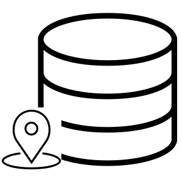

<!--
  ~ Licensed to the Apache Software Foundation (ASF) under one or more
  ~ contributor license agreements.  See the NOTICE file distributed with
  ~ this work for additional information regarding copyright ownership.
  ~ The ASF licenses this file to You under the Apache License, Version 2.0
  ~ (the "License"); you may not use this file except in compliance with
  ~ the License.  You may obtain a copy of the License at
  ~
  ~    http://www.apache.org/licenses/LICENSE-2.0
  ~
  ~ Unless required by applicable law or agreed to in writing, software
  ~ distributed under the License is distributed on an "AS IS" BASIS,
  ~ WITHOUT WARRANTIES OR CONDITIONS OF ANY KIND, either express or implied.
  ~ See the License for the specific language governing permissions and
  ~ limitations under the License.
  ~
  -->

## Geofence Sink

    

***

## Description

This processor creates a JTS LineString geometry from  JTS Points events, represent a trajectory. A trajectory is defined  as the path that a moving object follows through space as a function of time. Each sub-point of this LineString represents a single event. The latest sub-point represents the latest geo-event. For each Point event it is also possible to store an additional m-value representing for example actually speed, distance, duration or direction of this event. A trajectory consists of at least two sub-point and can't be infinitive, so a threshold of maximum allowed sub-points is required. When the sub-point threshold is exceeded, the oldest point is removed from the LineString.
***

## Required input

*  WKT String of a JTS Point Geometry
*  Integer value representing EPSG code
*  String Geofence name

***

## Configuration

STores a geometry in the internal PostGIS database. Geofence can be extraxted with the Geofence Enricher and chose geofence table.

### 1st parameter
Geometry WKT String

### 2nd parameter
EPSG code value

### 3rd parameter
name of the geofence. Has to be unique compared with other geofences.

***

### Example
